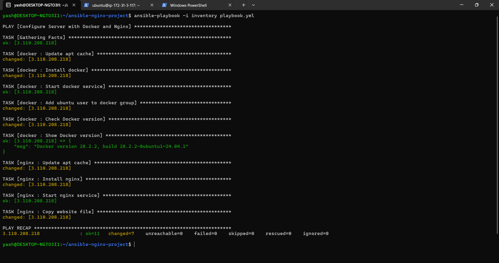
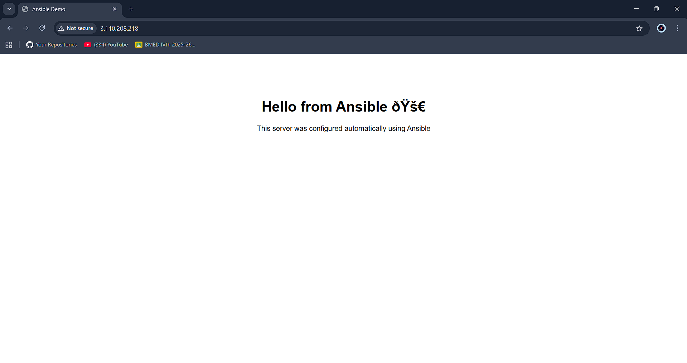
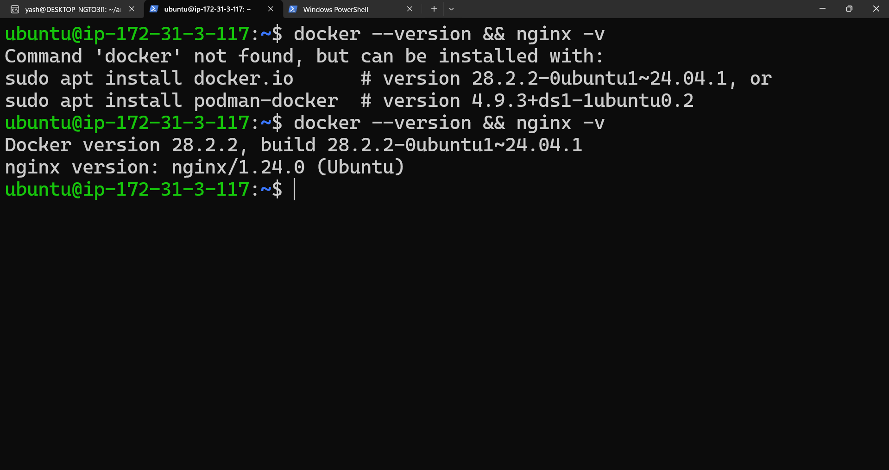

# 🚀 Ansible AWS Server Automation


This project demonstrates **Infrastructure Automation using Ansible** on an **AWS EC2 instance**.

The automation installs **Docker** and **Nginx**, configures services automatically, and deploys a simple website using **Ansible Roles**.

This project showcases **DevOps practices such as Infrastructure as Code, automation, and configuration management.**

---

# 📌 Project Overview

The playbook performs the following operations automatically:

* Connects to AWS EC2 instance using SSH
* Updates system packages
* Installs Docker
* Starts and enables Docker service
* Installs Nginx
* Starts and enables Nginx
* Deploys a static HTML website

After execution the website becomes accessible via the **EC2 public IP address**.

Example:

http://EC2_PUBLIC_IP

---

# 🏗 Architecture


Automation Flow:

Developer Machine (Ansible Control Node)
↓ SSH
AWS EC2 Instance (Managed Node)
↓
Ansible Playbook Execution
↓
Install Docker
Install Nginx
Deploy Website

---

# ⚙️ Tech Stack

* **Ansible**
* **AWS EC2**
* **Docker**
* **Nginx**
* **Linux (Ubuntu)**

---

# 📁 Project Structure

```
ansible-nginx-project
│
├── inventory
├── playbook.yml
│
├── roles
│   ├── docker
│   │   └── tasks
│   │       └── main.yml
│   │
│   └── nginx
│       ├── tasks
│       │   └── main.yml
│       │
│       └── files
│           └── index.html
│
├── images
│   ├── architecture-diagram.png
│   ├── ansible-playbook-run.png
│   ├── website-output.png
│   └── docker-nginx-version.png
│
└── README.md
```

---

# 📋 Prerequisites

Before running the automation:

* Linux / Ubuntu system
* Ansible installed
* AWS EC2 instance running
* SSH access using `.pem` key

Install Ansible:

```
sudo apt update
sudo apt install ansible -y
```

---

# 🖥 Inventory Configuration

Example inventory configuration:

```
[web]
EC2_PUBLIC_IP ansible_user=ubuntu ansible_ssh_private_key_file=practice.pem
```

---

# ▶️ Running the Playbook

Execute the playbook:

```
ansible-playbook -i inventory playbook.yml
```

The automation will:

1. Update system packages
2. Install Docker
3. Start Docker service
4. Install Nginx
5. Start Nginx service
6. Deploy the website

---

# 📊 Ansible Playbook Execution

Example playbook execution output:



---

# 🌐 Website Deployment

After running the playbook the website becomes available.

Example:

http://EC2_PUBLIC_IP



---

# 🔍 Server Verification

Verify Docker and Nginx installation:

```
docker --version
nginx -v
```

Example output:



---

# 🔑 Security Note

Private keys should **never be committed to GitHub**.

Add this to `.gitignore`:

```
*.pem
```

---

# 📚 Key Concepts Demonstrated

* Infrastructure as Code (IaC)
* Ansible Playbooks
* Ansible Roles
* AWS EC2 Automation
* Server Configuration Management
* Service Automation

---

# 🚀 Future Improvements

Possible improvements for this project:

* Deploy Docker containers using Ansible
* Add CI/CD using GitHub Actions
* Use Ansible templates (Jinja2)
* Configure Nginx reverse proxy
* Add monitoring tools

---


